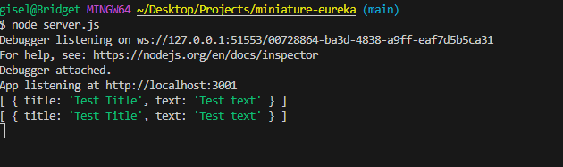
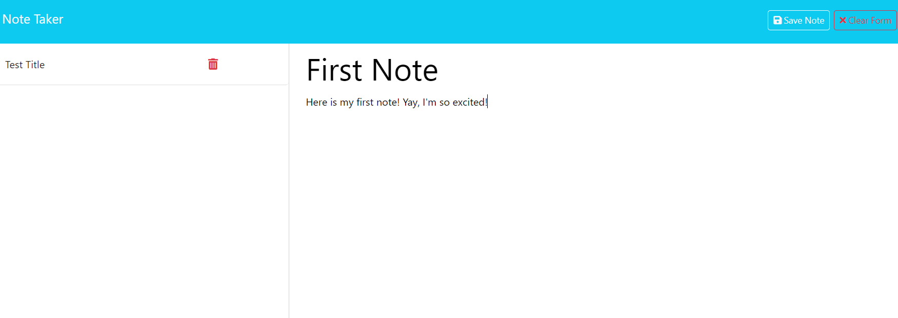

# Notes Made Easy
This simple note taking app makes it easier for you to keep track of all the things on your To Do list!

## Table of Contents
- [Description](#description)
- [Screenshots](#screenshots)
- [Technologies Used](#technologies-used)
- [Installation](#installation)
- [Features](#features)
- [Usage Information](#usage-information)
- [Contribution Guidelines](#contribution-guidelines)
- [Questions](#questions)

## Description

Notes Made Easy is a straightforward and intuitive note-taking application built to streamline your task management. Whether you need to jot down quick thoughts or organize your to-do list, this app provides a user-friendly interface to make note-taking a breeze.

### Screenshots
**Screenshots of application:**

## Technologies Used

This project is powered by Express.js on the server side, utilizing JavaScript for both front-end and back-end development. The app also uses Node.js with the file system module, and uniqid for generating unique IDs.

## Installation

1. Clone the repo: `git clone https://github.com/PotionSela/Notes-Made-Easy.git`
2. Open in VS Code. If you do not have VS Code, install it.
3. Using the terminal, install Node.js v16.
4. Once Node.js v16 is installed, in the terminal, run the command `npm init -y` to initialize and create a `package.json` where project files will be stored.
5. Next, use the terminal to run the command `npm i` to install the dependencies associated with this application. Developers may need to install inquirer directly from the command line. To do so, the command for inquirer will be `npm i inquirer@9.2.12` to install v9.2.12 of inquirer.
6. To run the application, within the terminal, type the command `node server.js`.

## Features

**Note Creation:** Easily create new notes with a title and content.
**Note Deletion:** Delete unwanted notes with a single click.
**Responsive Interface:** User-friendly design for an optimal experience.
**Persistent Storage:** All notes are saved and retrieved from a JSON database.

## Usage Information

To run this application, use the command line to navigate to the directory of the application, install all dependencies (`npm i`), then type the command `node server.js`. You will then have the server up and running, you can then go to your browser and type in `localhost:3001` and will be directed to a webpage that will gladly take any note you would like to write. Don't forget to give your notes a title! Otherwise the save button will not appear to save your valuable notes.

## Contribution Guidelines

Contributions to Notes Made Easy are welcome! If you choose to contribute, please open an issue to discuss the changes you would like to make. Feel free to modify anything on a feature branch and wait for approval before merging it into the main branch.

## Questions

Have additional questions? [Contact me through my GitHub account](https://github.com/PotionSela) or email me at giselamata27@gmail.com.